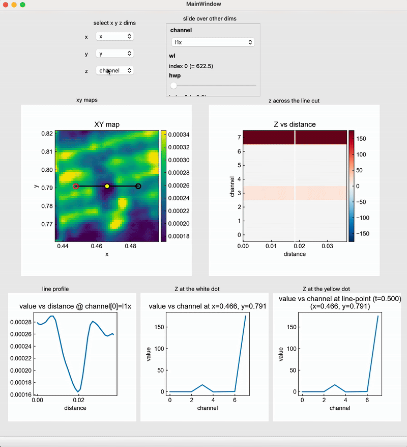

# XarrayViewer_QtGraph

Interactive **xarray** explorer for Jupyter/PyQtGraph.  
Select dimensions for X/Y/Z, draw line cuts on XY maps, and probe how Z changes along a cut or at specific points.

## Features
- Choose any dims for X, Y, Z (labeled coords supported)
- Interactive XY map with a draggable line cut
- **Z vs distance** along the line cut
- Probe a movable point on the line → **Z vs the Z-dimension**
- Runs in Jupyter with pyqtgraph and PyQt

## Installation
Clone the repository and install in editable mode:

```bash
git clone https://github.com/Mohamed-ShehabEldin/XarrayViewer_QtGraph.git
cd XarrayViewer_QtGraph
pip install -e .
```

If needed, set the Qt binding in your environment before launching Jupyter:

```bash
export QT_API=pyqt5    # or pyside6
```

## Usage

Example inside a Jupyter notebook:
```python
import os
os.environ["QT_API"] = "pyqt5"
```

```python
%gui qt5
```

```python
from XarrayViewer_QtGraph import XarrayViewer
from PyQt5 import QtWidgets

# Build or load a DataArray (example)
xr_all = xr.DataArray(
    [l1x_data, l1y_data, l1r_data, l1p_data, l2x_data, l2y_data, l2r_data, l2p_data],
    coords={
        "channel": ["l1x","l1y","l1r","l1p","l2x","l2y","l2r","l2p"],
        "wl": sk_to_nm(sk_axis),
        "hwp": hwp_axis,
        "y": ao1_axis,
        "x": ao0_axis,
    },
    dims=["channel","wl","hwp","y","x"]
)

viewer = XarrayViewer(xr_data=xr_all)
viewer.show()
```

Important:
- Set `QT_API` before running `%gui` or importing any Qt-backed library.
- Prefer `%gui qt5` when using the current `PyQt5`-based viewer.
- If Jupyter already loaded a different Qt binding such as `pyqt6`, restart the kernel before rerunning the notebook cells.

### Color Controls

The first two image plots have color controls:
- `plt1_*` controls the `XY map`
- `plt2_*` controls the `Z vs distance` plot

For each of those plots, the checkboxes behave as follows:
- `*_fix_clim_chkbx` keeps the colorbar limits fixed while you move sliders or change other free parameters. This is useful when you want weak signals to remain visibly weak relative to earlier views instead of being auto-rescaled each time.
- `*_sym_clim_chkbx` forces symmetric color limits around zero. The viewer sets `vmax = max(abs(data_min), abs(data_max))` and `vmin = -vmax`, so zero stays at the center color of the colormap.

These options are compatible:
- `sym` only: recompute symmetric limits on every update
- `fix` only: keep the current limits fixed
- `sym + fix`: compute symmetric limits from the current view once, then keep them fixed while you continue exploring

The QtGraph version also adds a `Color Controls` dock for the first two image plots:
- preset colormap selectors for quick switching
- an `Advanced` toggle for each plot
- a collapsible `HistogramLUTWidget` editor for each image

Inside the advanced editor you can:
- drag the histogram region to change display levels
- edit the colormap interactively
- add, move, recolor, or delete gradient anchors

If `fix` is enabled and you edit the levels manually, the edited levels become the stored fixed limits for that plot.

## Save And Reload

Use the `export current data` button in the main window to save the currently displayed state to a `.json` file.

The exported file contains:
- the current `x`, `y`, `z` dimension selections
- the current values of the other dimension controls
- the line-cut endpoints and white point position
- the yellow point position
- the data currently shown in the five plots

Example notebook cell to load an exported file:

```python
import json
import numpy as np
import matplotlib.pyplot as plt

with open("xarrayviewer_export_x_y_void.json", "r", encoding="utf-8") as f:
    exported = json.load(f)
```

Replot `Z at the yellow dot`:

```python
z_data = exported["plots"]["z_at_free_point"]

z_axis = np.asarray(z_data["z_coord"], dtype=float)
y_vals = np.asarray(z_data["value"], dtype=float)

fig = plt.figure(figsize=(5, 4))
ax = fig.add_subplot(1, 1, 1)
ax.plot(z_axis, y_vals)
ax.set_xlabel(z_data["z_dim"])
ax.set_ylabel("value")
ax.set_title("Z at the yellow dot")
plt.show()
```

Replot `Z at the white dot`:

```python
z_data = exported["plots"]["z_at_line_point"]

z_axis = np.asarray(z_data["z_coord"], dtype=float)
y_vals = np.asarray(z_data["value"], dtype=float)

fig = plt.figure(figsize=(5, 4))
ax = fig.add_subplot(1, 1, 1)
ax.plot(z_axis, y_vals)
ax.set_xlabel(z_data["z_dim"])
ax.set_ylabel("value")
ax.set_title("Z at the white dot")
plt.show()
```

Replot `value vs distance`:

```python
profile_data = exported["plots"]["xy_profile"]

distance = np.asarray(profile_data["distance"], dtype=float)
y_vals = np.asarray(profile_data["value"], dtype=float)

fig = plt.figure(figsize=(5, 4))
ax = fig.add_subplot(1, 1, 1)
ax.plot(distance, y_vals)
ax.set_xlabel("distance")
ax.set_ylabel("value")
ax.set_title("value vs distance")
plt.show()
```

Replot `Z vs distance` including the saved white vertical line:

```python
zdist_data = exported["plots"]["z_vs_distance"]
vline_x = exported["state"]["zdistance_vline_x"]

z_vals = np.asarray(zdist_data["coords"][zdist_data["dims"][0]], dtype=float)
distance = np.asarray(zdist_data["coords"]["distance"], dtype=float)
image = np.asarray(zdist_data["values"], dtype=float)

fig = plt.figure(figsize=(6, 4))
ax = fig.add_subplot(1, 1, 1)
im = ax.imshow(
    image,
    origin="lower",
    aspect="auto",
    extent=[distance.min(), distance.max(), z_vals.min(), z_vals.max()],
)
ax.axvline(vline_x, color="white")
ax.set_xlabel("distance")
ax.set_ylabel(zdist_data["dims"][0])
ax.set_title("Z vs distance")
fig.colorbar(im, ax=ax)
plt.show()
```

Replot the `XY map` including the saved line cut and both points:

```python
xy_data = exported["plots"]["xy_map"]
state = exported["state"]

x_vals = np.asarray(xy_data["coords"][xy_data["dims"][1]], dtype=float)
y_vals = np.asarray(xy_data["coords"][xy_data["dims"][0]], dtype=float)
image = np.asarray(xy_data["values"], dtype=float)

line_cut = state["line_cut"]
line_point = state["line_point"]
free_point = state["free_point"]

fig = plt.figure(figsize=(6, 5))
ax = fig.add_subplot(1, 1, 1)
im = ax.imshow(
    image,
    origin="lower",
    aspect="auto",
    extent=[x_vals.min(), x_vals.max(), y_vals.min(), y_vals.max()],
)
ax.plot([line_cut["x0"], line_cut["x1"]], [line_cut["y0"], line_cut["y1"]], "k-")
ax.plot(line_cut["x0"], line_cut["y0"], "ro", mfc="none")
ax.plot(line_cut["x1"], line_cut["y1"], "ko", mfc="none")
ax.plot(line_point["x"], line_point["y"], "wo")
ax.plot(free_point["x"], free_point["y"], "yo")
ax.set_xlabel(xy_data["dims"][1])
ax.set_ylabel(xy_data["dims"][0])
ax.set_title("XY map")
fig.colorbar(im, ax=ax)
plt.show()
```


## Demo

Short GIF showing dimension selection, line cut, and probing:



## Roadmap
- Width-averaged line cuts
- Export figures and data
- 3D browsing and keyboard shortcuts
- Optional support for multiple datasets
